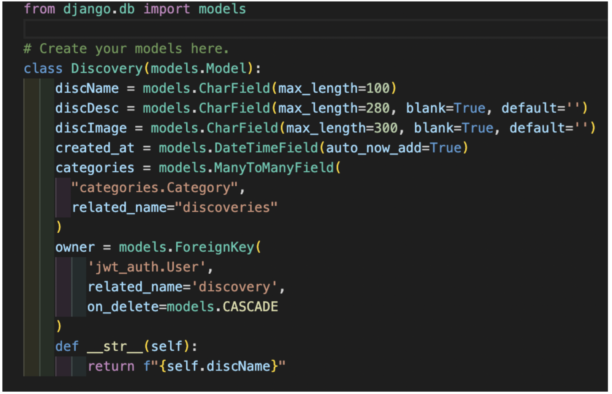
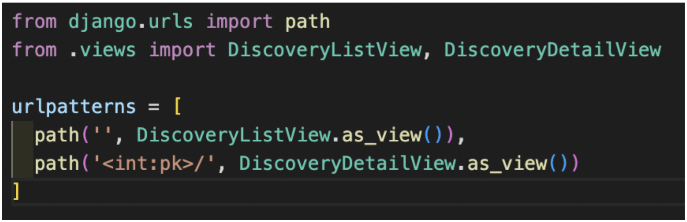

## Description

For my final project of the General Assembly Software Engineering Bootcamp, I was asked to implement my knowledge of Django and Python, which I had learnt in the week prior. The full-stack application needed to use a Python Django API and a Django REST Framework to serve data from a Postgres database. My API had to be consumed with a front-end and built with React. It was also suggested that our app should have CRUD functionality. 

## Deployment link

https://i-got-there-first.herokuapp.com/

## Overview

## Timeframe & Working Team (Solo/Pair/Group)

This was a solo project, with a 1 week timeframe

## Technologies Used

### Backend

Django
Python
TablePlus
Insomnia

### Frontend

HTML
JavaScript
CSS
Sass
React
React-Bootstrap
React-Select

### Development Tools

Excalidraw
Heroku
Netlify
GitHub

## Planning

This project was an incredibly valuable learning experience, especially when it came to managing time and ambitions.

My initial plan was to create a job application website. From my time working as a teacher, I knew that exams are marked without the examiner knowing the students’ names. This is done to prevent accidental biases and discrimation affecting the marking. The ‘secret sauce’ of my job application website would be that, like school exams, names and email addresses would be replaced with candidate numbers to allow companies to hire ‘blind’.

I planned for this project for the first day creating a plan for my front-end:

 I created the following ERD so that I would know how I would create my backend:

There were two signs that I had perhaps bitten off more than I could chew. The first sign was that the turnaround for this project was tight  - the brief was almost identical to our previous group project (and that had three people working on it!). My MVP would include a complex dual user  feature, which we hadn’t been taught - was it sensible to be this ambitious? The second sign was that my free trial ended on lucid.app (the website I used to create my ERD) before I could finish.

I ended up settling on my back-up plan, a website to log your predictions for the ‘next big thing’. My app would let you post “discoveries” you had found, which would include the date, and a comment system which would record when you found each “discovery”. This would allow you to objectively say that you did get there first. You could prove that you were a trendsetter!

Knowing I was now a day behind, my plan was more rushed than I would have liked (which definitely caused problems later on!) I created my front end. This plan was, perhaps, an overcorrection, having spent the first day making something too complicated I was keen to not repeat that mistake. In retrospect, I can see that I was planning on making something too simple.

I also created my second Entity Relationship Diagram, this time for my trendsetter app.

Being the last project on the course, I was in two minds about how to approach the brief. The first option was to play it safe and make something that worked well and looked good just using knowledge I already had. The second option (and one I ended up taking) was to take risks, experiment and learn more as a result. In every project, going forward, when I get stuck I will work on styling, error handling and working to debug my app. This project was different because it is likely to be the last project that I undertake, where the aim is to learn and where I would have support from my tutors when I got stuck. My approach was to do more and learn more, even if that meant failing more.

## Build/Code Process

This was my first experience of creating a back-end using Python. I planned out my ERD and spent the first few days creating my back-end and testing out all of my routes in Insomnia. Initially, the features my website had were a login feature, and CRUD functionality on ‘discoveries’. This was a reasonably straightforward process as we had created something similar to this over the previous week in class.

To do this, I created my discovery model which eventually would allow the user to add the discovery name, description, an image and categories with the owner and ‘created at’ added automatically:

I added my URL paths:

And created my Discovery List and Detail Views in views.py:

I also updated my apps in my installed_apps section of my project folder and updated URL patterns in my project folder.

Once I was happy that my back-end worked, I created my front end. My JWT_Auth allowed users to register and login and logged in users could create ‘discoveries’, and could edit and delete their own ‘discoveries’. All users (logged in or not) could read all ‘discoveries’.

The first additional feature I added was a ‘categories’ feature which allowed users to add what type of ‘discovery’ they were adding. Categories were a many-to-many relationship and meant each discovery could have multiple categories. I also set up my ‘categories’ to have a drop down menu with preselected options. 

This meant creating categories in my backend.

I created a model like above:

And my views:

Unfortunately, as already stated, my rushed planning meant that I lost time in the execution of my code. This is a good demonstration of that happening. I hadn’t planned properly for categories, instead I just started coding assuming I would be able to make it all work. If I had spent just a little bit more time preparing, I could have created my backend looking like it does above. Instead, I coded for almost every eventuality and my views look the same as my discoveries. It means that as an admin I have CRUD functionality of categories (which isn’t that helpful). I would have saved a lot of time (and had a better end product) if I planned for longer and focussed on creating features the user could use. Realistically, the only function that is needed is get.

In order to add categories to my front end, I needed to use documentation, researching how to use React-Select (https://react-select.com/props). This is how I ended up displaying my categories, using a combination of React-Select and the map function. I also spread in my categories so that more than one category could be added. The Select function meant that my categories were presented as a drop down menu so that users knew which categories they could pick.

The next feature I added involved Cloudinary which meant users could upload their own images. This was the first time in any of my projects where I added a feature for users to add their own images. I read the documentation and taught myself how to use it. I was very pleased with the result and happy that even the user’s images could be updated when updating discoveries. 

The next feature I added was a comment section, a one-to-many relationship. As the point of the comment section is to have a record of what users thought at a specific point in time, I didn’t want there to be an update option. This meant my comment section only had create, read and delete functionality. 

There were a few problems I encountered adding a delete function to the comments.

The first was that I would need to add a delete button which should only be visible to the user who left the comment. This was solved by adding the following ternary which checked if the user was logged in.

{userIsOwner(comment) &&

Where userIsOwner was defined as:

export const userIsOwner = (discovery) => {
const payload = getPayload()
 if (!payload) return
 return payload.sub === discovery.owner.id
}

..and getPayload was defined as: 

export const getPayload = () => {
 const token = getToken()
 if (!token) return
 const splitToken = token.split('.')
 if (splitToken.length !== 3) return
 return JSON.parse(Buffer.from(splitToken[1], 'base64'))
}

I also knew that my axios request would need to look like:
 await axios.delete(`/api/comments/comment.id/`)

To access the comment.id, I made the value of the delete button comment.id, and so made the axios request: 

 await axios.delete(`/api/comments/event.target.value/`)

Once I added my comments, I attempted to add a ‘tag’ feature. I was able to get the tag function working in the backend but I ran out of time before being able to add it to my front end. My plan was to add logic which checks if the user has already ‘tagged’ the discovery. If they have then the button won’t display. Once they press the button, the ‘discovery’ would be added to their profile. I also wanted to add a profile page which would show all the user’s ‘discoveries’ when viewed. 

## Challenges

I think the initial rush to get my plan done led to many avoidable mistakes. By trying to save time and just get going creating code, I ended up spending a lot more time having to fix issues where there shouldn’t have been any. My initial plan on the front end lacked a comment section, but there was a comment section on the back-end. I hadn’t planned to add categories and so had to adapt my backend to include them. There were also issues on my front end as I had assumed that creating the categories on the backend would be difficult but the frontend would be straight-forward. I ended up having to read through unfamiliar documentation (https://react-select.com/props) and asking for help from my instructors to get what (at least to the user) appears to be a very simple feature. Finally, the constant adapting meant that I couldn’t seed my data, data that worked in one database wouldn’t necessarily follow onto another. This meant that each time I added a new feature, I added my discoveries from scratch. 

## Wins

As already stated, I approached this project knowing that this was likely to be an ambitious failure in which I hoped to learn from my mistakes. Knowing that I had the support of my tutors if I got stuck, I thought this project was an amazing opportunity to experiment. The end result is my project has a few unfinished, buggy features and I am not happy with how it looks. 

If I could do this project again, however, I would not change my approach. I could have made the CSS neater, but I felt 11 weeks into the course I had already practised that skill. Instead I added ‘nice to have’ features - some more successfully than others. I think adding categories, Cloudinary and my comments system was a win. Even though my tag system was ultimately a failure, I would still call it a ‘win’ because I learnt so much trying (unsuccessfully) to implement it. 

Overall, My app has working CRUD functionality, a working comment section and crucially, a comment section which shows the date the comment was left. The idea, having a website which logs when you found the next big thing, works as you can see when people leave their comments. 

## Key Learnings/Takeaways

My previous project had a one week timeframe, but had three people working on it. This project had the same timeframe, a near identical brief, but I was the only person working on it. This was made more challenging as we had only learnt Django and Python for one week before starting this project.

I now feel much more confident working with APIs, Django and Python. This project has given me a much stronger understanding of SQL databases and ERD. I also think this has given me greater foundational knowledge in overall database design, recognising the differences between SQL and NoSQL databases and a deeper understanding of how the front-end and back-end connect, be it using Django and Python or MERN. 

## Bugs

On mobile, the pictures are too big on the discovery single page. 

When adding a ‘discovery’, the user needs to wait a few seconds before submitting or the image won’t have time to upload.

When editing a discovery, the errors automatically appear when they shouldn’t.

Moving forward, having felt confident at the time with styling, I recognise that there were mistakes made. The most significant mistake is that I wish that I designed my app with a mobile-first design.

## Future Improvements

There are a lot of features I added because I was keen to learn, but this means that a lot of features are half finished.

The main future improvements I would want to add are:

Search by Category - Allow the user to click on each category to view all ‘discoveries’ which match that category.

As discussed in my code build section, I would like to implement the plan of having a working ‘tag’ button and a profile section which displays the user’s tags. 

User Comments - It was only in the last few hours that I noticed a big problem with my comment system - the user comments were anonymous. Under time pressure, I quickly came up with an inelegant system of clicking to find out who left the comment. I would fix this so that my app shows who left the comment next to the comment.

Overall, there are small bugs, which need to be fixed and the styling should be improved, but my approach for the project - to do more and learn more, meant this was inevitable. Regardless of how much I learnt, my app has bugs, and should look nicer, and in a future improvement, I would want to fix this.